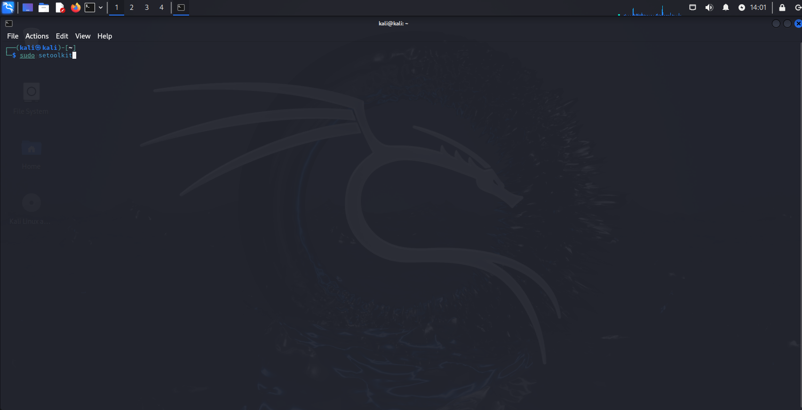
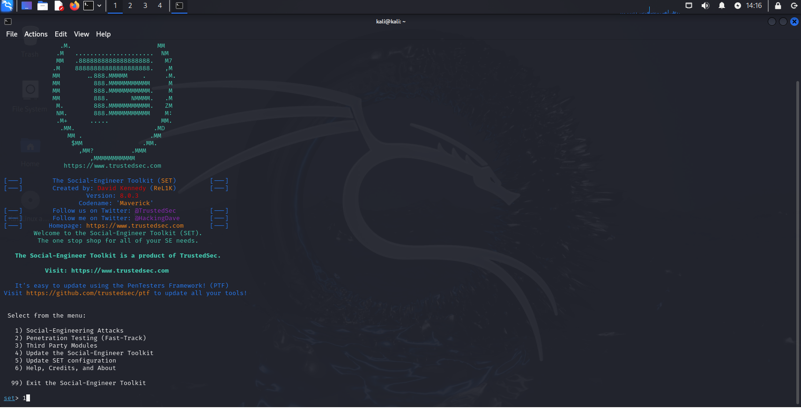
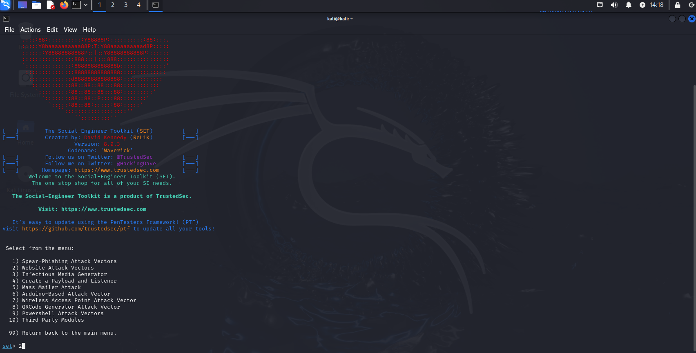
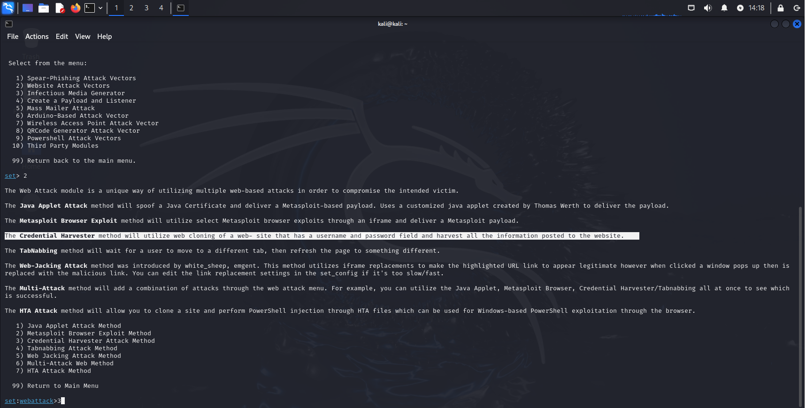
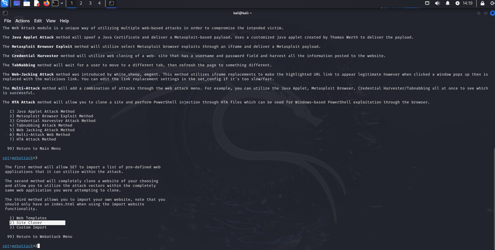
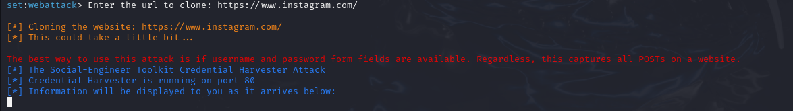
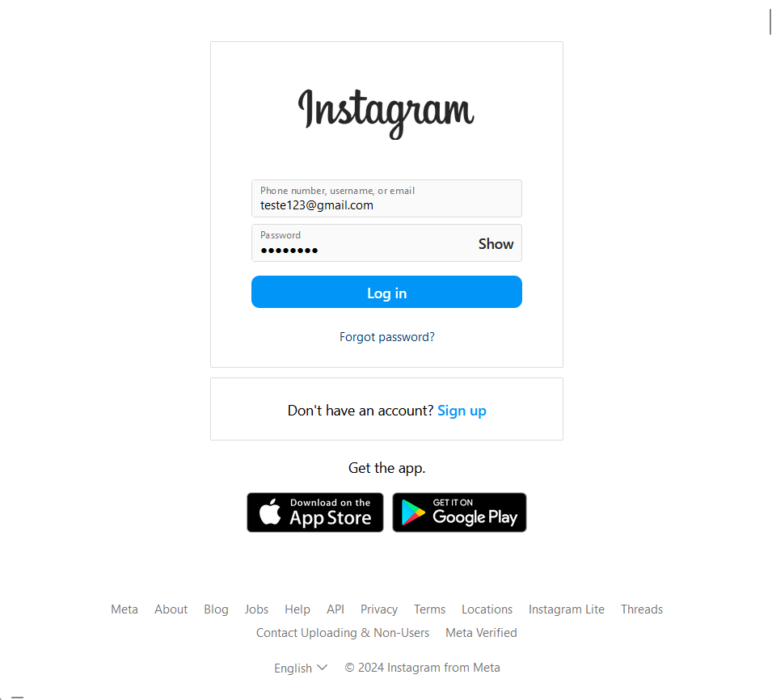
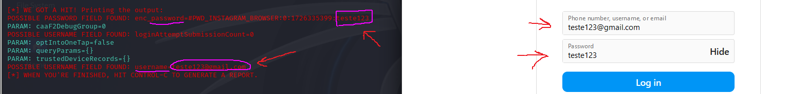

# Criação de um phishing com o kali linux - Curso da [DIO](https://web.dio.me)

**O que é um Phishing?**
Phishing é um dos ataques ciberneticos mais populares envolvendo engenharia social(forma de enganar outras pessoas para obter informações importantes de forma ilegal, tais como:senhas bancarias,numero do cartao de credito, entre outras.)

nota: Phishing vem do ingles ***"fishing"*** que significa "pescar", ou seja, é um ataque onde se espera que um peixe(algúem) morda a isca(caia no golpe).

link de uma página que achei com exemplos mais sólidos de phishing para conhecimento geral: [5 tipos de phishing e exemplos da vida real](https://dtnetwork.com.br/5-tipos-de-phishing-e-exemplos-da-vida-real/)

## Irei demonstrar um exemplo seguindo o passo a passo do curso da DIO e adicionarei outras informações que acho relevante:


1-Vamos utilizar a [setoolkit](https://github.com/trustedsec/social-engineer-toolkit)

```
sudo setoolkit
```


#

2-Selecione a opção 1 para ataques de engenharia social:



#

3-Selecione a opção 2 para vetores de ataque em websites

nota: Attack Vectors(vetores de ataque) é o nome dado ao metodo de ataque/ameaça de um agente(atacante)



#

4-Vamos utilizar a opção 3 (Credential Harvester Attack Method), que em resumo vai clonar um website procurando por campos de formulario(que permitem colocar um username e uma senha) e assim coletar("harvester") para o atacante



#

5-Selecionamos a opção de clonagem de sites



#

6-Colocamos a url desejada para clonagem, nesse caso utilizei a do [Instagram](https://www.instagram.com/)



#

7-Exemplo de credenciais no nosso site clonado



#

8-Ao clicar no botão de login, percebemos que a entrada do usuario é mostrada para o atacante com o uso do setoolkit




## Considerações finais:

Todo o conteudo mostrado neste repositorio tem fins claramente didáticos (até porque seria muito improvável um ataque **da forma que foi demonstrado aqui** funcionar na realidade) e achei interessante a DIO abordar esse tipo de ataque, pois apesar da apresentação modesta, o phishing é a abertura para diversos outros ataques. Segue uma noticia sobre o numero de ataques com email de phishing: [90% dos ataques a empresas começam com um e-mail de phishing, alerta estudo](https://securityleaders.com.br/90-dos-ataques-a-empresas-comecam-com-um-e-mail-de-phishing-alerta-estudo)
